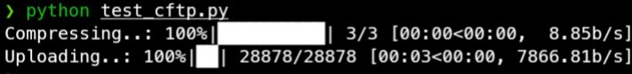
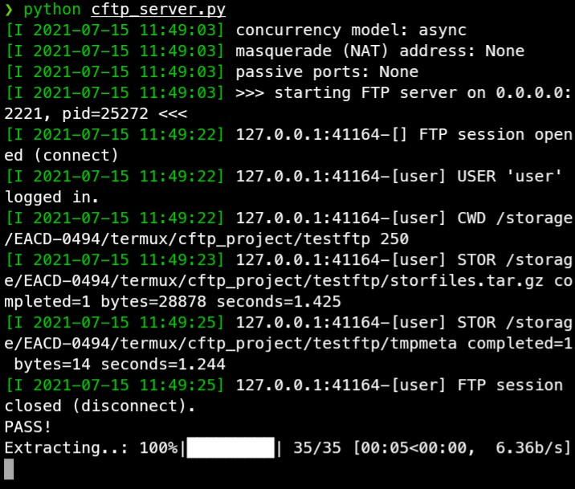

# cftp
CFTP - Compression add-on for File Transfer Protocol

# About CFTP
CFTP uses gzip and tar compression to reduce the size of the transferred files and combine them into one tar.gz archive stored in the server and client caches (useful for a large number of photos, text files and other small files in large quantities) and auto-extracting them on the server, which  greatly increases the speed of transferring files via ftp

# Client device

# Server device

The size of the cache in the current version depends on the size of the transferred files and the cache is deleted immediately after the completion of the file transfer/receive operations.
